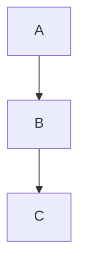

# Azure DevOps Markdown Guidance

This reference describes Markdown syntax supported by Azure DevOps features including Wiki pages, README files, dashboards, and pull requests.

## Supported Features

| Markdown type | Definition of Done | Widget | Pull Requests | README | Wiki |
|---|---|---|---|---|---|
| Headings | Yes | Yes | Yes | Yes | Yes |
| Paragraphs/line breaks | Yes | Yes | Yes | Yes | Yes |
| Blockquotes | Yes | Yes | Yes | Yes | Yes |
| Horizontal rules | Yes | Yes | Yes | Yes | Yes |
| Emphasis (bold, italic) | Yes | Yes | Yes | Yes | Yes |
| Tables | No | Yes | Yes | Yes | Yes |
| Lists (ordered, unordered) | Yes | Yes | Yes | Yes | Yes |
| Links | Yes | Yes | Yes | Yes | Yes |
| Images | No | Yes | Yes | Yes | Yes |
| Code highlighting | No | Yes | Yes | Yes | Yes |
| Math notation | No | No | Yes | Yes | Yes |
| Checklists/task lists | No | No | Yes | Yes | Yes |
| Mermaid diagrams | No | No | No | No | Yes |

> **Note:** Markdown in Azure DevOps doesn't support JavaScript or iframes.

## Headings

```markdown
# Heading 1
## Heading 2
### Heading 3
#### Heading 4
##### Heading 5
###### Heading 6
```

## Paragraphs and Line Breaks

Use a blank line for new paragraphs. Use two spaces at line end or `<br/>` for line breaks within a paragraph.

## Blockquotes

```markdown
> Single blockquote
>> Nested blockquote
```

## Horizontal Rules

Use three or more hyphens, asterisks, or underscores on a line by themselves.

## Emphasis

```markdown
*Italic* or _Italic_
**Bold** or __Bold__
***Bold italic***
~~Strikethrough~~
```

## Code Highlighting

**Inline:** Use single backticks `` `code` ``

**Block:** Use triple backticks with optional language identifier:

````markdown
```javascript
const x = 1;
```
````

Supported languages include: ActionScript, Apex, Bash, C, C#, C++, CSS, Dart, Go, Groovy, Haskell, HTML, Java, JavaScript, JSON, Kotlin, Lua, Markdown, Objective-C, Perl, PHP, PowerShell, Python, R, Ruby, Rust, Scala, Shell, SQL, Swift, TypeScript, XML, YAML, and more.

## Tables

```markdown
| Header 1 | Header 2 |
|----------|----------|
| Cell 1   | Cell 2   |
```

Alignment with colons: `:---` (left), `:---:` (center), `---:` (right).

## Lists

**Ordered:**

```markdown
1. First item
2. Second item
```

**Unordered:**

```markdown
- Item 1
- Item 2
```

**Nested:** Indent with spaces.

## Links

```markdown
[Link text](URL)
[Link text](URL "Title")
```

**Anchor links:** Link to headings within the same page using `#section-name`.

## Images

```markdown


```

Azure DevOps supports image resizing with `=WIDTHxHEIGHT` syntax.

## Checklists / Task Lists

```markdown
- [ ] Incomplete task
- [x] Completed task
```

## Mathematical Notation

**Inline:** `$` delimiters: `$e^{i\pi} = -1$`

**Block:** `$$` delimiters:

```markdown
$$
\sum_{i=1}^{n} x_i
$$
```

Uses KaTeX for rendering.

## Mermaid Diagrams (Wiki only)

````markdown

````

Supports: flowcharts, sequence diagrams, Gantt charts, and more.

## Collapsible Sections

```html
<details>
  <summary>Click to expand</summary>

  Content here (leave blank line after summary tag).
</details>
```

## Emoji

Use standard emoji shortcodes: `:smile:`, `:thumbsup:`, etc.

## Special Characters

Escape special Markdown characters with backslash: `\*`, `\#`, `\[`, etc.

## HTML Tags

Supported HTML tags in Wiki include: `<div>`, `<span>`, ``, `<br>`, `<table>`, `<tr>`, `<td>`, `<th>`, `<strong>`, `<em>`, `<code>`, `<pre>`, `<blockquote>`, `<ul>`, `<ol>`, `<li>`, `<h1>`-`<h6>`, `<hr>`, `<p>`, `<a>`, `<details>`, `<summary>`, `<video>`, `<audio>`.
